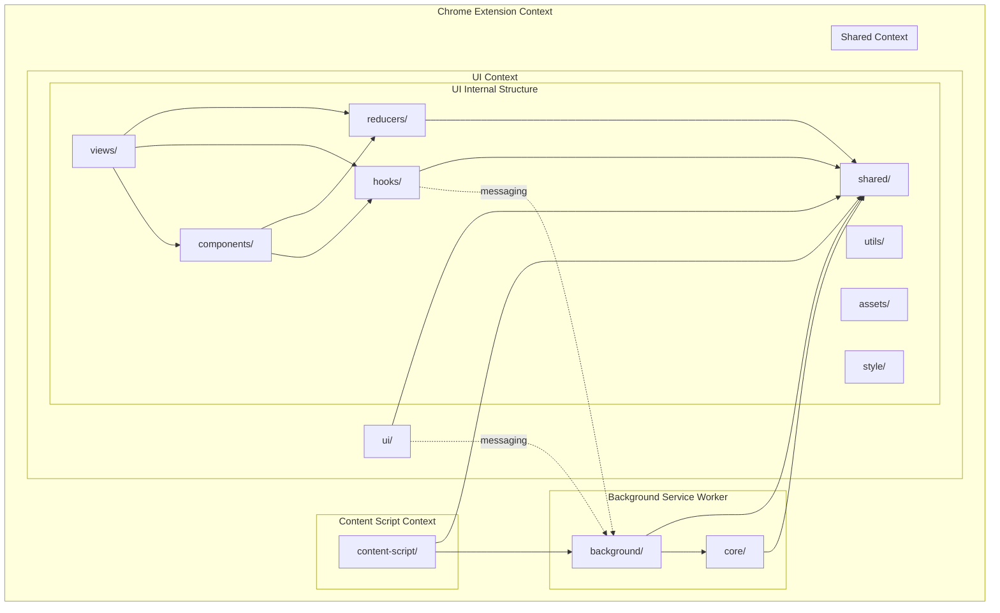

# Flow Reference Wallet Extension - Architecture and API Documentation

## Table of Contents

1. [Project Overview](#project-overview)
2. [Architecture](#architecture)
   - [Folder Structure](#folder-structure)
   - [Architecture Diagram](#architecture-diagram)
   - [Layer Responsibilities](#layer-responsibilities)
   - [Communication Patterns](#communication-patterns)
3. [Wallet Account Structure](#wallet-account-structure)
   - [Private Keys](#private-keys)
   - [Public Keys](#public-keys)
   - [Main Accounts](#main-accounts)
   - [Child & EVM Accounts](#child--evm-accounts)
   - [Profiles](#profiles)
4. [API Documentation](#api-documentation)
   - [Authentication](#authentication)
   - [Account Management](#account-management)
   - [Token Operations](#token-operations)
   - [NFT Operations](#nft-operations)
   - [Transaction Operations](#transaction-operations)

## Project Overview

The Flow Reference Wallet is a Chrome extension that serves as a wallet for the Flow blockchain. It allows users to manage their Flow accounts, interact with dApps, and perform transactions on the Flow blockchain. The extension also supports EVM (Ethereum Virtual Machine) accounts for interacting with Ethereum-compatible blockchains.

## Architecture

### Folder Structure

The codebase is organized into distinct layers with strict import rules to maintain separation of concerns and prevent architectural violations:

```
src/
├── background/          # Chrome extension background scripts
├── core/               # Core business logic and services
├── ui/                 # Popup UI components and views
│   ├── components/     # Reusable UI components
│   ├── views/         # Page-level components and screens
│   ├── hooks/         # Custom React hooks
│   ├── reducers/      # State management reducers
│   ├── utils/         # UI-specific utilities
│   ├── assets/        # Static assets (images, fonts, etc.)
│   └── style/         # Styling and theming
├── content-script/     # Web page content scripts
└── shared/            # Shared utilities and types
```

### Architecture Diagram



### Layer Responsibilities

#### 1. Background (`src/background/`)

- **Purpose**: Chrome extension background service worker
- **Responsibilities**:
  - Extension lifecycle management
  - Message routing between UI and core
  - Chrome API interactions
  - Wallet controller coordination
- **Can import from**: `@/core/*`, `@/shared/*`
- **Cannot import from**: `@/ui/*`

#### 2. Core (`src/core/`)

- **Purpose**: Core business logic and services
- **Responsibilities**:
  - Wallet services (keyring, transactions, etc.)
  - Blockchain interactions
  - Business logic
  - Data persistence
- **Can import from**: `@/shared/*`, `@/background/webapi/*`
- **Cannot import from**: `@/ui/*`, `@/background/*` (except webapi)

#### 3. UI (`src/ui/`)

- **Purpose**: Popup interface and user interactions
- **Responsibilities**:
  - React components and views
  - User interface logic
  - State management for display
  - User input handling
- **Can import from**: `@/shared/*`
- **Cannot import from**: `@/core/*`, `@/background/*`
- **Communication**: Uses messaging to communicate with background/wallet controller

#### 4. Content Script (`src/content-script/`)

- **Purpose**: Web page integration
- **Responsibilities**:
  - dApp provider injection
  - Web page communication
  - Flow FCL and Ethereum provider interfaces
- **Can import from**: `@/background/*`, `@/shared/*`

#### 5. Shared (`src/shared/`)

- **Purpose**: Common utilities and types
- **Responsibilities**:
  - Type definitions
  - Utility functions
  - Constants
  - Common helpers
- **Can import from**: Nothing outside shared
- **Cannot import from**: Any other folder

### Communication Patterns

#### UI ↔ Background Communication

UI communicates with background through Chrome extension messaging:

```typescript
// UI hooks
export const useWallet = () => {
  const walletController = new WalletController();

  const getAccounts = async () => {
    return await walletController.getAccounts();
  };

  return { getAccounts };
};

// Background side
chrome.runtime.onMessage.addListener((message, sender, sendResponse) => {
  // Handle messages from UI
});
```

#### Background ↔ Core Communication

Background directly imports and uses core services:

```typescript
// Background
import { keyringService } from '@/core/service/keyring';
const accounts = await keyringService.getAccounts();
```

## Wallet Account Structure

### Private Keys

At its heart, this is what a Wallet stores - private keys. A private key without a public key is just bytes. A cryptographic algorithm is used to generate public keys from private keys. This way it is possible to have multiple public keys against a private key depending on the algorithm used to generate it.

The wallet supports multiple algorithms, but generally a single profile in a wallet has one public key associated with it. When you login to a wallet, you are "unlocking" a set of private keys.

Private keys should never be transmitted across the network. They are stored locally in the wallet and can only interact with things associated with the public key that is paired with a private key it stores.

### Public Keys

A public key can be associated with one or more Accounts on Flow. These accounts are referred to as "Main Accounts" - accounts that run natively with Cadence on the Flow network.

Each Account can have one or more public keys. If you log in with a specific public key, you get access to all accounts associated with that key.

### Main Accounts

An account on the Cadence network (Main Account) has the following properties:

- **Address**: unique identifier for the account
- **Public Keys**: public keys authorized on the account
- **Code**: Cadence contracts deployed to the account
- **Storage**: area of the account used to store resource assets
- **Nickname (wallet only)**: Automatically assigned animal names for Main accounts
- **Emoji (wallet only)**: Automatically assigned based on the nickname

There is a many-to-many relationship between public keys and accounts. Just because a wallet has access to an account does not mean it has access to every public-private key associated with it.

### Child & EVM Accounts

Each "Main Account" can have child accounts:

- EVM account: To interact with the Ethereum network
- Child Dapper account: Using Cadence

When a new account is created in Flow Wallet, an EVM account is always created with it. Other child accounts are linked to a Main Account through dApps.

### Profiles

A user can set up multiple profiles in Flow Wallet. A profile has:

- A nickname - set by the user during registration
- A globally unique username - the nickname with a number at the end
- A single private key associated with it

There is no linkage between profiles. Creating or importing a new account creates a new profile. The wallet supports one private key per profile.

## API Documentation

The Flow Reference Wallet Extension uses a service-oriented architecture for API calls. The main service for API interactions is the `OpenApiService` class, which provides methods for various operations.

### Authentication

#### Register

```typescript
register = async (account_key: AccountKeyRequest, username: string)
```

- **Purpose**: Registers a new user
- **Parameters**:
  - `account_key`: Object containing public_key, sign_algo, and hash_algo
  - `username`: User's chosen username
- **Returns**: Registration data including user ID and custom token

#### Login

```typescript
loginV3 = async (
  account_key: AccountKeyRequest,
  device_info: DeviceInfoRequest,
  signature: string,
  replaceUser = true
): Promise<SignInResponse>
```

- **Purpose**: Logs in a user
- **Parameters**:
  - `account_key`: Object containing public_key, sign_algo, and hash_algo
  - `device_info`: Device information
  - `signature`: Signature for authentication
  - `replaceUser`: Whether to replace the current user
- **Returns**: Sign-in response including user ID and custom token

#### Import Key

```typescript
importKey = async (
  account_key: AccountKeyRequest,
  device_info: DeviceInfoRequest,
  username: string,
  backup_info: any,
  address: string,
  replaceUser = true
): Promise<SignInResponse>
```

- **Purpose**: Imports a key
- **Parameters**:
  - `account_key`: Object containing public_key, sign_algo, and hash_algo
  - `device_info`: Device information
  - `username`: User's chosen username
  - `backup_info`: Backup information
  - `address`: Account address
  - `replaceUser`: Whether to replace the current user
- **Returns**: Sign-in response including user ID and custom token

### Account Management

#### Create Flow Address

```typescript
createFlowAddress = async();
createFlowAddressV2 = async();
```

- **Purpose**: Creates a new Flow address
- **Returns**: Data about the created address

#### Get Flow Account

```typescript
getFlowAccount = async (address: string)
```

- **Purpose**: Gets information about a Flow account
- **Parameters**:
  - `address`: Flow account address
- **Returns**: Account information

#### Get Accounts With Public Key

```typescript
getAccountsWithPublicKey = async (publicKey: string, network: string)
```

- **Purpose**: Gets accounts associated with a public key
- **Parameters**:
  - `publicKey`: Public key
  - `network`: Network (mainnet or testnet)
- **Returns**: List of accounts

### Token Operations

#### Fetch Token Lists

```typescript
fetchFTList = async (network: string, chainType: string): Promise<TokenInfo[]>
fetchFTListFull = async (network: string, chainType: string): Promise<FungibleTokenInfo[]>
```

- **Purpose**: Fetches lists of fungible tokens
- **Parameters**:
  - `network`: Network (mainnet or testnet)
  - `chainType`: Chain type (flow or evm)
- **Returns**: List of tokens

#### Get Token Balances

```typescript
getTokenListBalance = async (address: string, allTokens: TokenInfo[]): Promise<BalanceMap>
getTokenBalanceStorage = async (address: string): Promise<BalanceMap>
```

- **Purpose**: Gets token balances for an address
- **Parameters**:
  - `address`: Account address
  - `allTokens`: List of tokens (for getTokenListBalance)
- **Returns**: Map of token balances

#### Check Token Storage

```typescript
isTokenStorageEnabled = async (address: string, token: CustomFungibleTokenInfo)
isTokenListEnabled = async (address: string)
isLinkedAccountTokenListEnabled = async (address: string)
```

- **Purpose**: Checks if token storage or lists are enabled
- **Parameters**:
  - `address`: Account address
  - `token`: Token information (for isTokenStorageEnabled)
- **Returns**: Boolean indicating if enabled

### NFT Operations

#### Get NFT Lists

```typescript
nftCatalogList = async (address: string, limit: any, offset: any, network: string)
nftCatalogCollections = async (address: string, network: string): Promise<NFTCollections[]>
nftCatalogCollectionList = async (
  address: string,
  contractName: string,
  limit: any,
  offset: any,
  network: string
)
```

- **Purpose**: Gets lists of NFTs and collections
- **Parameters**:
  - `address`: Account address
  - `network`: Network (mainnet or testnet)
  - `limit` and `offset`: Pagination parameters
  - `contractName`: Contract name (for nftCatalogCollectionList)
- **Returns**: NFT data

#### Get EVM NFTs

```typescript
getEvmNFT = async (address: string, network: string)
EvmNFTcollectionList = async (
  address: string,
  collectionIdentifier: string,
  limit = 24,
  offset = 0
)
EvmNFTID = async (network: string, address: string)
```

- **Purpose**: Gets EVM NFTs and collections
- **Parameters**:
  - `address`: Account address
  - `network`: Network
  - `collectionIdentifier`: Collection identifier (for EvmNFTcollectionList)
  - `limit` and `offset`: Pagination parameters (for EvmNFTcollectionList)
- **Returns**: EVM NFT data

### Transaction Operations

#### Sign Transactions

```typescript
signPayer = async (transaction: string, message: string)
signBridgeFeePayer = async (transaction: string, message: string)
signProposer = async (transaction: string, message: string)
```

- **Purpose**: Signs transactions as payer, bridge fee payer, or proposer
- **Parameters**:
  - `transaction`: Transaction to sign
  - `message`: Message
- **Returns**: Signed transaction data

#### Get Transaction Template

```typescript
getTransactionTemplate = async (cadence: string, network: string)
```

- **Purpose**: Gets a transaction template
- **Parameters**:
  - `cadence`: Cadence code
  - `network`: Network
- **Returns**: Transaction template
